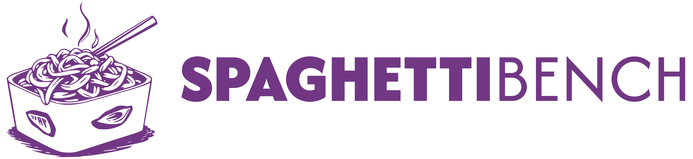

<a href="https://github.com/cmu-pasta/spaghetti-bench">
  
</a>

A benchmark for evaluating AI coding agents on concurrency bug tasks.

## Setup

There are two ways to run Spaghetti Bench:

### Option 1: Docker (Recommended)

Pull the pre-built Docker image:

```bash
docker pull ghcr.io/cmu-pasta/spaghetti-bench:latest
```

Or build from source using Nix:

```bash
nix build .#dockerImage
docker load < result
```

The Docker image includes:
- Python 3.13 with all dependencies
- OpenJDK 21
- [Fray](https://github.com/cmu-pasta/fray) - JVM concurrency testing tool
- Standard Unix utilities (bash, grep, find, sed, awk, git, tmux)

### Option 2: Manual Setup

**Prerequisites:**
- Python 3.11+
- Java 21+
- [Fray](https://github.com/cmu-pasta/fray) installed and available in PATH

**Install Fray:**

```bash
# Clone and build Fray
git clone https://github.com/cmu-pasta/fray.git
cd fray
./gradlew shadowJar

# Add to PATH (add to ~/.bashrc or ~/.zshrc)
export PATH=$PATH:/path/to/fray/build/install/fray/bin
```

**Install Python dependencies:**

```bash
# Using uv (recommended)
uv sync

# Or using pip
pip install -e .
```

**Set API key:**

```bash
export LLM_API_KEY="your-api-key"
```

## Quick Start

Run all tasks from a benchmark:

```bash
python src/concurrency_bench/run_agent.py \
  --tasks-file src/concurrency_bench/sctbench.jsonl \
  --task-type fix_bug \
  --model-id bedrock/global.anthropic.claude-sonnet-4-5-20250929-v1:0
```

Run on real-world Kafka bugs:

```bash
python src/concurrency_bench/run_agent.py \
  --tasks-file src/concurrency_bench/kafka.jsonl \
  --task-type fix_bug \
  --model-id bedrock/global.anthropic.claude-sonnet-4-5-20250929-v1:0
```

Run a single task:

```bash
python src/concurrency_bench/run_agent.py \
  --tasks-file src/concurrency_bench/sctbench.jsonl \
  --task-type fix_bug \
  --model-id bedrock/global.anthropic.claude-sonnet-4-5-20250929-v1:0 \
  --instance-id Reorder3Bad
```

## Available Task Files

- `src/concurrency_bench/sctbench.jsonl` - SCTBench synthetic bugs (28 tasks)
- `src/concurrency_bench/kafka.jsonl` - Apache Kafka bugs (11 tasks)
- `src/concurrency_bench/all.jsonl` - All tasks combined (39 tasks)

## Command-Line Options

| Option | Required | Description |
|--------|----------|-------------|
| `--tasks-file` | Yes | Path to JSONL file containing tasks |
| `--task-type` | Yes | Task type: `fix_bug` or `trigger_bug` |
| `--model-id` | Yes | Model ID (must be LiteLLM compatible) |
| `--instance-id` | No | Run only the specified task |
| `--results-dir` | No | Directory to save results (default: `results/`) |
| `--enable-fray-tools` | No | Give agent access to Fray debugging tools |
| `--keep-result` | No | Keep temporary workspace after completion |
| `--max-workers` | No | Docker only: Max parallel workers |
| `--memory` | No | Docker only: Memory limit (e.g., `16g`) |
| `--cpus` | No | Docker only: CPU limit (e.g., `8`) |

## Output

### Console Output

```
================================================================================
Running task: Reorder3Bad
Description: Memory ordering bug with concurrent reads and writes
Task type: fix_bug
Model: bedrock/global.anthropic.claude-sonnet-4-5-20250929-v1:0
================================================================================

Created workdir: /tmp/concurrency_bench_Reorder3Bad_abc123/
Copied benchmarks/SCTBench/cs/origin/Reorder3Bad.java
Starting agent...
...
Agent finished!

Verifying results...
Success: True
Saved conversation to: results/fix_bug/sctbench/Reorder3Bad.json
```

### Results Directory

Results are saved in a structured format:

```
results/
└── {model_id}/
    └── {with_fray|without_fray}/
        └── {rep_id}/
            └── {task_type}/
                └── {benchmark_category}/
                    ├── {instance_id}.json
                    └── {instance_id}.patch
```

Each JSON file contains:
- Task metadata (instance_id, description, category)
- Model information
- Success/failure status
- Setup and verification output
- Full conversation event stream (messages, tool calls, responses)

Each `.patch` file contains a git diff of the changes made by the agent.

## Visualizing Results

### Trace Visualizer

View agent conversations interactively:

```bash
cd viz
python3 serve_traces.py
```

Then open http://localhost:8001 in your browser.

**Features:**
- Interactive timeline of agent events
- GitHub-style patch diff viewer
- Auto-loading from results directory
- Shareable trace URLs
- Search and filter by model/category

### Leaderboard

Generate aggregated results:

```bash
cd viz
python3 aggregate_results.py
```

This creates `leaderboard_data.json` with:
- Pass@1 and Pass@5 metrics for each model
- Breakdown by benchmark category
- Model rankings

View the leaderboard by opening `viz/index.html` in a browser.

## Benchmarks

### SCTBench

SCTBench is a suite of concurrency bugs translated to Java, located in `benchmarks/SCTBench/`:

- **cs/origin/** - Original bugs (races, atomicity violations, deadlocks)
- **cs/hard/** - Challenging variants with more threads
- **cb/** - Concurrent data structure bugs
- **chess/** - Work-stealing queue bugs

### Real-World Projects

Real-world bugs from open-source projects:

- **Apache Kafka** - 11 concurrency bugs from the Kafka streams library
- Full repository is cloned at bug-triggering commit
- Tests run with Fray to systematically explore thread interleavings

## Architecture

### Three-Layer Design

1. **Tasks** (`src/concurrency_bench/tasks/`)
   - `FixBugTask`: Identify and fix concurrency bugs
   - `TriggerBugTask`: Write test cases that reproduce bugs
   - Task loaders handle building and running benchmarks

2. **Agents** (`src/concurrency_bench/agents/`)
   - `FixBugAgent`: Specialized in fixing concurrency issues
   - `TriggerBugAgent`: Specialized in creating reproducible test cases
   - Built on [OpenHands Agent SDK](https://docs.openhands.dev/sdk/)

3. **Runner** (`src/concurrency_bench/run_agent.py`)
   - Loads tasks from JSONL
   - Creates isolated workspace per task
   - Runs agent and verifies results
   - Saves full conversation data

### Workflow

```
Load Task → Create Workspace → Copy Files → Run Agent → Verify → Save Results → Cleanup
```

## Task File Format

Tasks are defined in JSONL format (one JSON object per line):

**SCTBench example:**
```jsonl
{"instance_id": "Reorder3Bad", "path": "benchmarks/SCTBench/cs/origin/Reorder3Bad.java", "description": "Memory ordering bug", "benchmark_category": "sctbench", "subcategory": "cs/origin", "loader": "SCTBenchLoader"}
```

**Real-world example:**
```jsonl
{"instance_id": "Kafka_KAFKA-18418", "repo_url": "https://github.com/apache/kafka.git", "commit": "3.8.0", "test_class": "org.apache.kafka.streams.KafkaStreamsTest", "test_method": "shouldReturnFalseOnCloseWhenThreadsHaventTerminated", "description": "Race condition in shutdown", "benchmark_category": "real-world", "subcategory": "kafka", "loader": "KafkaLoader"}
```

**Required fields:**
- `instance_id`: Unique task identifier
- `loader`: Class name that handles build/run (e.g., `SCTBenchLoader`)
- `benchmark_category`: Category (e.g., `sctbench`, `real-world`)
- `description`: Human-readable description

## Development

### Adding New Benchmarks

1. Add benchmark files to `benchmarks/`
2. Create a task loader in `src/concurrency_bench/tasks/loaders/`
3. Add task entries to a JSONL file
4. Run with `--tasks-file your_tasks.jsonl`

### Modifying the Docker Image

The Docker image is built from `flake.nix`. After making changes:

```bash
nix build .#dockerImage
docker load < result
```

**Note:** Python code changes don't require rebuilding - `run_agent.sh` mounts the local directory.

## Citation

```bibtex
@misc{spaghettibench2025,
  title={Spaghetti Bench: Evaluating AI Agents on Concurrency Bug Fixes},
  author={Vikram, Vasu and Li, Ao and Padhye, Rohan},
  year={2025},
  url={https://github.com/cmu-pasta/spaghetti-bench}
}
```

## License

This project is licensed under the MIT License - see LICENSE file for details.

## Contributing

Contributions are welcome! Please feel free to submit a Pull Request.
